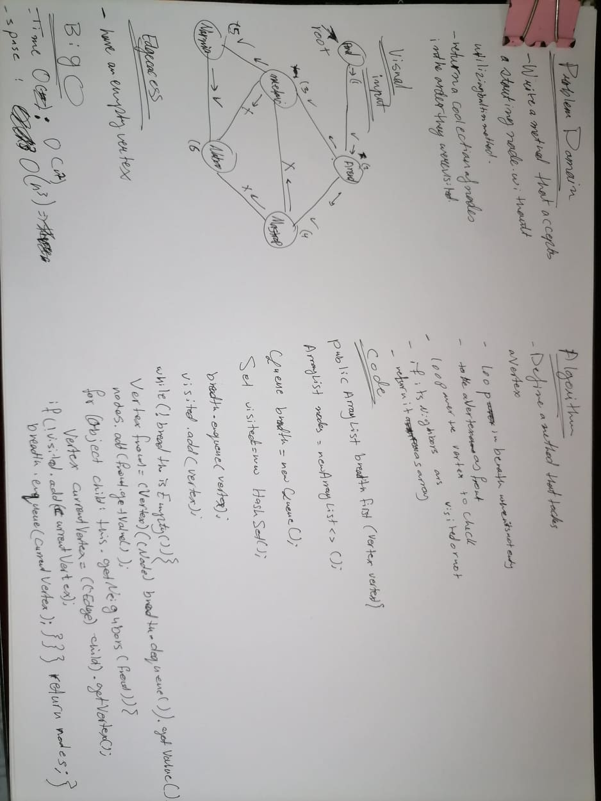

# Code Challenge: Class 35: Graph Implementation

# Graphs
<!-- Short summary or background information -->
### What is Graphs ?
- A graph is a non-linear data structure
- can be looked at as a collection of vertices
- connected by line segments named edges.
### Terminology
- `Vertex`: also called a “node”, is a data object that can have zero or more adjacent vertices.
- `Edge`: is a connection between two nodes.
- `Neighbor`: The neighbors of a node are its adjacent nodes
- `Degree`: The degree of a vertex is the number of edges connected to that vertex.
## Challenge
<!-- Description of the challenge -->

- **Implement a Graph with the following methods :**
- `AddNode()` :
   - This method, adds a new node to the graph.
- `AddEdge()` :
   - This method, adds a new edge between two nodes in the graph
   - Include the ability to have a “weight”
   - Takes in the two nodes to be connected by the edge
   - Both nodes should already be in the Graph
- `GetNodes()` : Returns all of the nodes in the graph as a collection.
- `GetNeighbors()` : 
   - This method, returns a collection of edges connected to the given node
   - Takes in a given node
   - Include the weight of the connection in the returned collection
- `Size()`:
  - This method, returns the total number of nodes in the graph
## Approach & Efficiency
<!-- What approach did you take? Why? What is the Big O space/time for this approach? -->
 Each method within the graph class takes `O(1) time and space` as they utilize the methods on Lists.

## API
- `getNodes()` : 
   - no input.
   - returns an ArrayList of all the Nodes within the Graph.

- `getNeighbors()` : 
   - input : Node as an argument, and 
   - returns an ArrayList of neighbors for that Node, where each value is an Edge that points to a neighbor.

- `size()` : 
   - no inputs.
   -  returns the total number of Nodes in the Graph.

- `addNode()` : 
  - input: value -->> creates a new Node with that value.
  -  adds it to the Graph.
  -   returns the new Node.

- `addEdge()` : 
  - input : two unique Nodes that are in the Graph.
  - Include the ability to have a “weight”. 
  - It will add an Edge to each of the provided Nodes list of neighbors. 

# Code Challenge: Class 36
# Implement a breadth-first traversal on a graph

 ## Challenge
 - writhe a m method which  accepts a starting node and do traversal  over graph. 
 -  return a collection of nodes in the order they were visited. Display the collection.
## Approach and Efficiency
- Time : O(n^2)
  - loop over the breadth ,then loop in to check all the visitors .
- Space: O(n^3)
   - for saving the Vertices in three storage each has O(n)
## Solution

# Code Challenge: Class 37
# GetEdge 

 ## Challenge
 - Given a business trip itinerary, and Airlines map.
 - Check is the trip possible with direct flights? If so.
 -  find the total trip cost.
## Approach and Efficiency

## Solution

