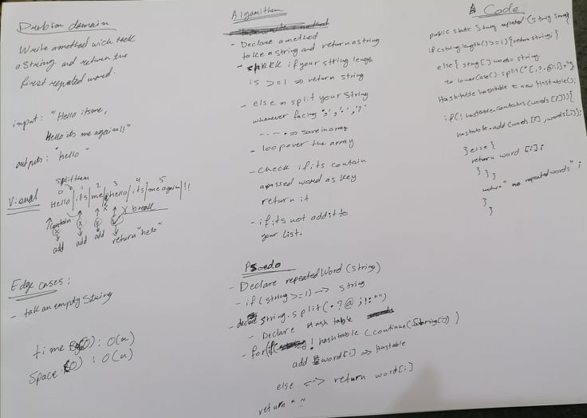
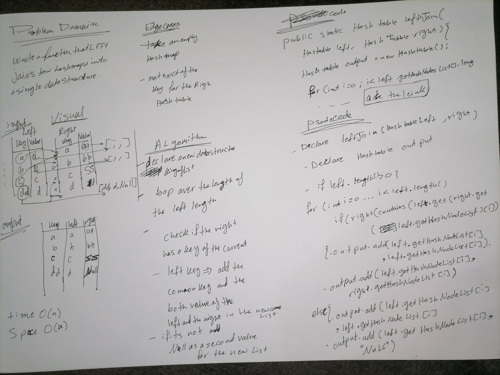

# Code Challenge: Class 30
# Hash Table Implementation

## Hashtables
 A hash table (hash map) is a data structure that implements an associative array abstract data type, a structure that can map keys to values. A hash table uses a hash function to compute an index, also called a hash code, into an array of buckets or slots, from which the desired value can be found.
## Challenge
- **Implement a `Hashtable` with the following methods** :

- `add` : this method takes in both the key and value. This method should hash the key and add the key and value pair to the table.
- `get` : this method named that takes in the key and returns the value from key/value pair.
- `contains` : this method takes in the key and returns a boolean, indicating if the key exists in the table already.
- `hash` : this method takes in an arbitrary key and returns an index in the collection.
## Approach & Efficiency

- for all methods the Time Complexity : O(n) 
- for `contains` ,`git` , `hash` methods the Space Complexity : O(1) 
- for `add` method the Space Complexity : O(1) 
## API
- `add`
Takes in a key and a value, hashes the key and adds the pair to the index for that hash. 
- `contains`
Takes in a key and returns true if that key is already in the table, false if not. 
- `get`
Takes in a key and returns that value associated with it in the table. Will throw a NoSuchElementException if the key is not in the table.
- `hash` : 
Takes in an arbitrary key and returns an index in the collection.
#
# Code Challenge: Class 31
# Repeated Word
## Challenge
- Write a method that takes in a String and returns the first repeated word in that String.
-  Without utilizing any of the built-in library methods .
## API 
- `repeatedWord` : take a string ,return the first repeated word.
- `Add` and `contains`:as mention in  the documentation above .
## Approach and Efficiency
- The approach for this was to split the string words whenever you faced one of these `[" " , ",","?",".","@",":",";"]`, and insert them to array of string.
- from the declared methods above use the contain method which check if the word is not exist as a key add it to the hashTable as a key  ,else return it .
- This solution takes O(n) time and space.
  - For time complexity ,we loop over the array of string till reach the first repeated word.
  - For space we added each new word to our hashTable.
## Solution 

#
# Code Challenge: Class 32
#
# Code Challenge: Class 33
# Left Join
## Challenge
- Write a function that LEFT JOINs two hashmaps into a single data structure.
- Avoid utilizing any of the library methods available to your language.

## Approach and Efficiency
-  create a hashTables with a size equal to that of the number of keys stored in the left hashTable.
- The new hashTable will hold a key of that left one keys', and its value in the two tables. 
- If the second hashTable also contains that key, its value is added to the hashTable as well, otherwise it is set to NULL. 
- This method takes
  -  O(n) time a where n represents the total key/value pairings in the first hashTable.
  -  O(n)  space where n represents the total key/value pairings in the first hashTable.
## Solution

