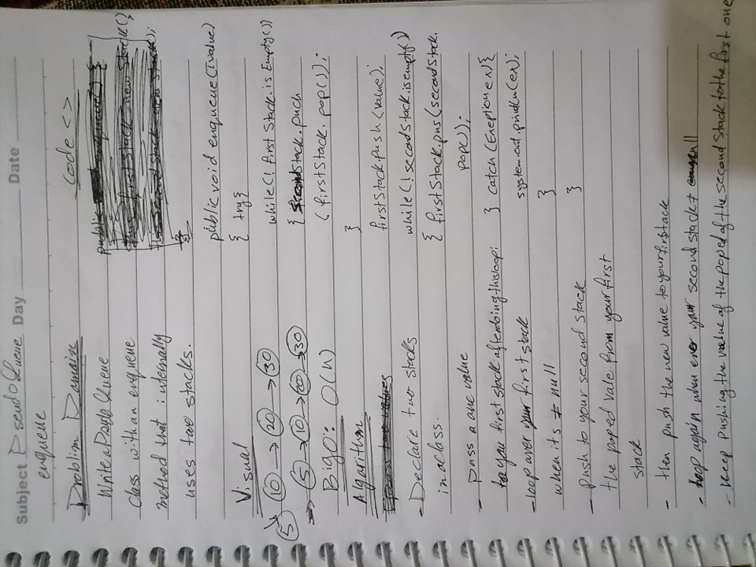

# Stack and a Queue Implementation
## Stacks and Queues
Contains a Stack, Queue, and Node class. The Stack operates on a last in first out (LIFO) basis, and the Queue operates on a first in first out (FIFO) basis. A Stack object contains a reference to its top Node, a Queue object contains references for the front and rear Nodes. Each Node contains a value and a reference to the next Node in the Stack/Queue.

## Challenge
- Create a Node class that has properties for the value stored in the Node, and a pointer to the next Node.
- Create a Stack class that has a top property. It creates an empty Stack when instantiated.
- This object should be aware of a default empty value assigned to top when the - stack is created.
- Define a method called push which takes any value as an argument and adds a new node with that value to the top of the stack with an O(1) Time performance.
- Define a method called pop that does not take any argument, removes the node from the top of the stack, and returns the node.
- Define a method called peek that does not take an argument and returns the node located on the top of the stack.
- Create a Queue class that has a top property. It creates an empty queue when instantiated.
- This object should be aware of a default empty value assigned to front when the - queue is created.
- Define a method called enqueue which takes any value as an argument and adds a new node with that value to the back of the queue with an O(1) Time performance.
- Define a method called dequeue that does not take any argument, removes the node from the front of the queue, and returns the node.
- Define a method called peek that does not take an argument and returns the node located in the front of the stack.
## Approach & Efficiency
The approach for the push method is to point the top reference to a new Node containing the provided value and it's next being the old top of the stack. The pop method temporarily stores the top node, sets the top to be the old tops next, and returns the old tops value. The enqueue method adds a new Node as the next of the old rear, then sets the rear to point at the new Node. Dequeue works in the same way as the pop method, but uses the front of the queue, as opposed to the top.

## API
## **Stack**
- Push
Takes in a value and adds a new Node with the provided value to the top of the stack with a O(1) time efficiency.

- Pop
Removes the top Node from the stack and returns its value.

- Peek
Returns the current top Node of the stack.

## **Queue**
- Enqueue
Takes in a value and adds a new Node to the rear of the queue with a O(1) time efficiency.

- Dequeue
Removes the front Node from the queue and returns its value.

- Peek
Returns the current front Node of the queue.

## Challenge
Implement a Pseudo Queue class that acts just like a Queue but operates internally using two stacks. It should include an enqueue and dequeue method that work under the first in first out basis.

## Approach and Efficiency
* push : O(1)
* pop : O(1)
* peek : O(1)
* isEmpty : O(1)

# WB

#
# Implement a Queue using two Stacks.

# Challenge Summary
<!-- Short summary or background information -->
> **In this challenge I will implement a Queue using two Stacks.
> by using only stack methods:`push(),pop(),isEmpty()`

## Challenge Description
<!-- Description of the challenge -->
- Write an `enqueue(value)` which inserts value into the `PseudoQueue`:
    -  using a first-in, first-out approach.
- `dequeue()` which extracts a value from the `PseudoQueue`: using a first-in, first-out approach.
- Know that the Stack instances have only: `push, pop, and peek` methods.
- You should use your own Stack implementation.
## Approach & Efficiency
<!-- What approach did you take? Why? What is the Big O space/time for this approach? -->
- for `enqueue` method,Maintain the queues state in one primary stack.
- pop the primary stack and push each value into the secondary stack when a new item needs to be added. 
When the primary stack is empty, the enqueued value is added to it.
- reversed the process.
- `dequeue` method simply just has to pop the top value from the primary stack and return in.
- **enqueue(value)** 
   - Big O : O(n)
- **dequeue()**
   -  Big O : O(1)
## Solution
<!-- Embedded whiteboard image -->

