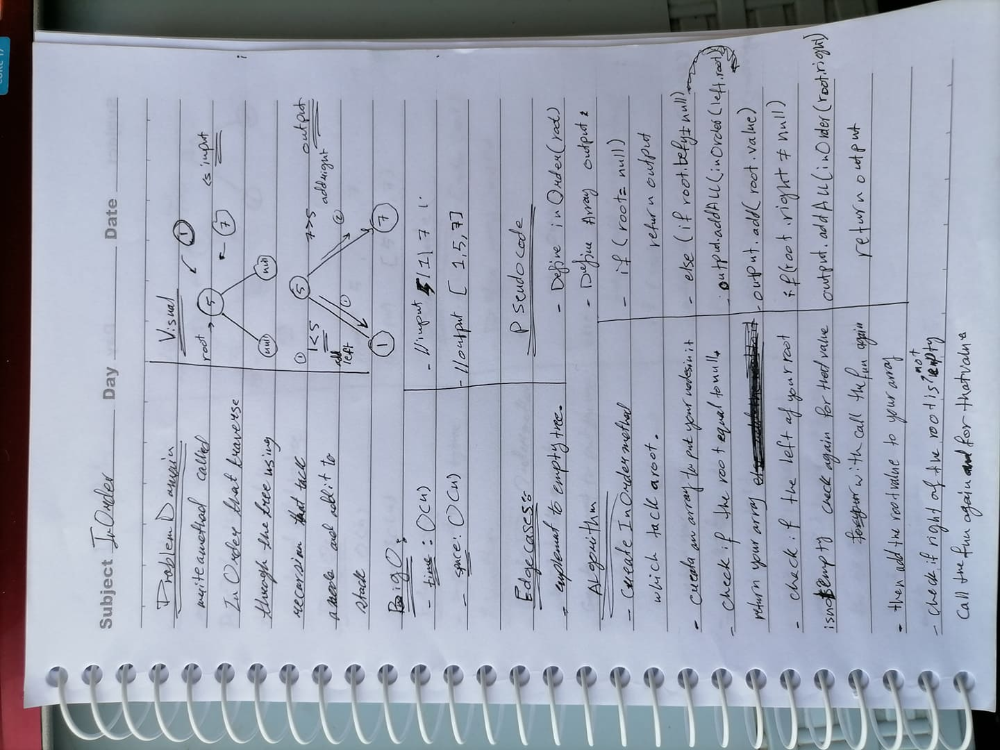
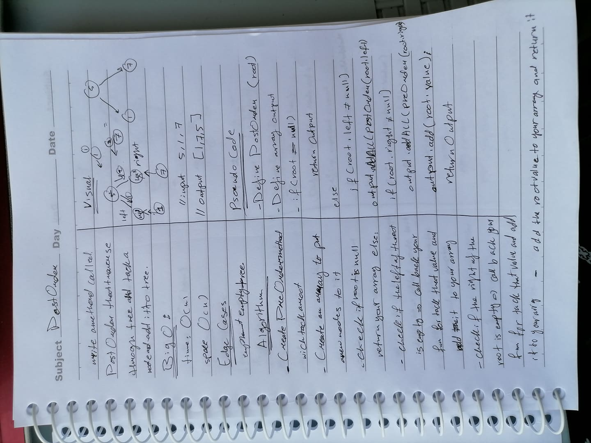
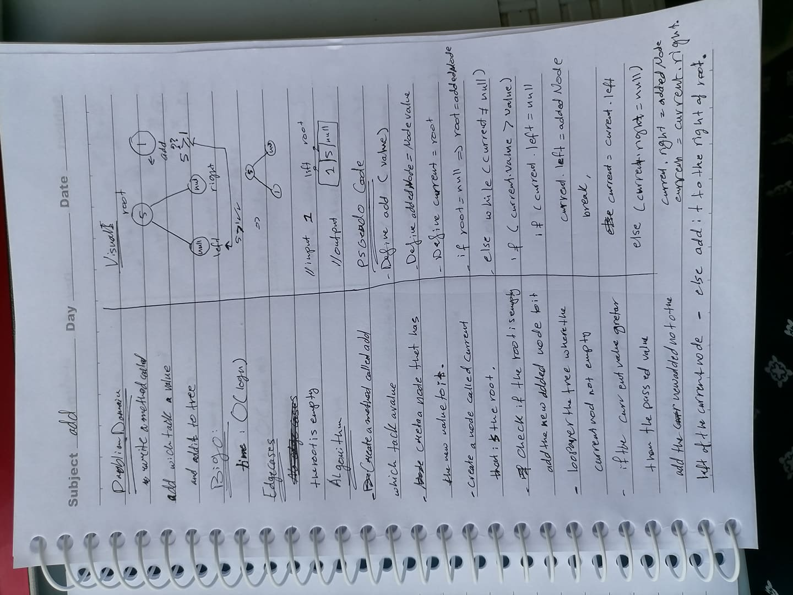
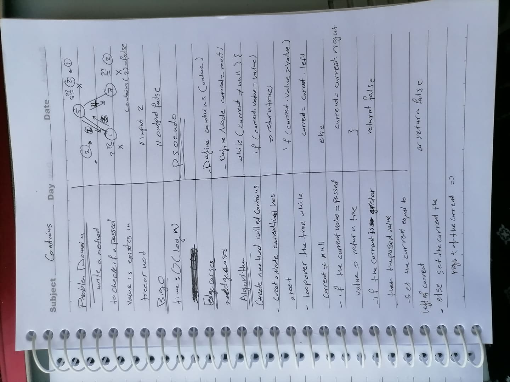

# Trees
## Code Challenge: Class 15: Binary Tree and BST Implementation

## Contains"
 - `BinaryTree`, `BinarySearchTree`, `Tree`,and `Node class`.
  - the class Node has :
       - left child. 
       - right child.
-  A BinaryTree is for just a collection of these nodes, while a - BinarySearchTree will sort them to the left or right based on their value in comparison to the root.
```
│   └── src
│       ├── main
│       │   ├── java
│       │   │   └── tree
│       │   │       ├── App.java
│       │   │       ├── BinarySearchTree.java
│       │   │       ├── BinaryTree.java
│       │   │       ├── Node.java
│       │   │       └── Tree.java
│       │   └── resources
│       └── test
│           ├── java
│           │   └── tree
│           │       └── AppTest.java
```
## Challenge
* Create a Node class that has properties for the value stored in the node, the left child node, and the right child node.
* Create a BinaryTree class
*  To returns an array of the values, ordered appropriately ,define a method for each of the depth first traversals called:
    *  preOrder
    *  inOrder
    *  postOrder 
.
## API
`preOrder`
Takes in a root node, and returns the all nodes in the tree as an ArrayList ordered by root, left, right.

`inOrder`Takes in a root node, and returns the all nodes in the tree as an ArrayList ordered by left, root, right.

`postOrder`
  Takes in a root node, and returns the all nodes in the tree as an ArrayList ordered by left, right, root.

`add`
  Takes in a value and traverses the BinarySearchTree to add it in the correct place

`search`    
  Takes in a value and returns the node that contains that value, or null if no node contains that value.
## Approach & Efficiency
`The preOrder`, `inOrder`, and `postOrder`
-  methods all traverse the tree recursively
   - Big O: Big O( n)
- `add` and `contains`
  -  Big O: Big O(log n)
  # Solution :
  
  
  
  
  
 
