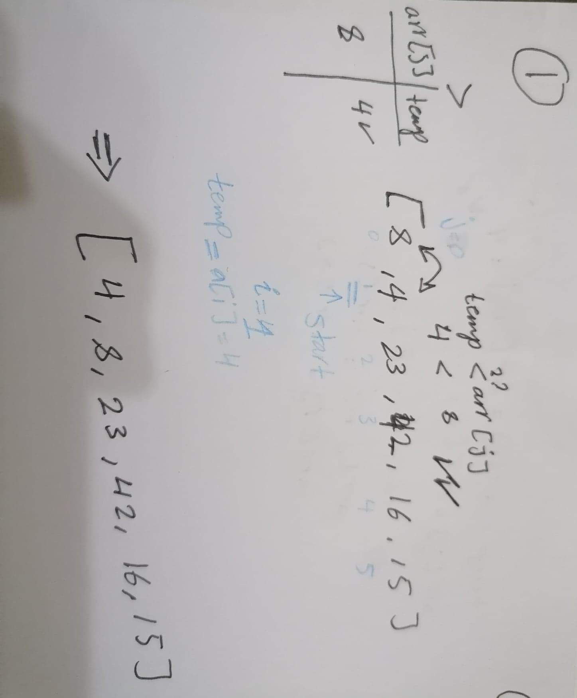
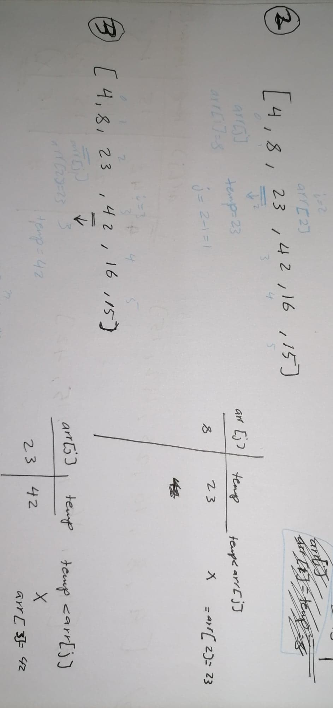
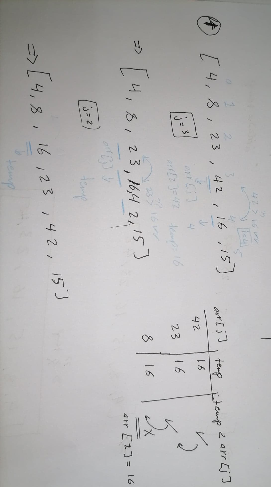
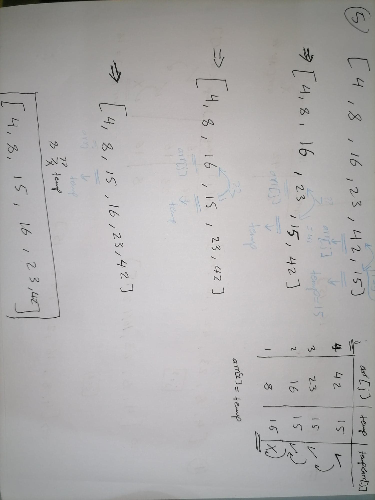

# Insertion Sort
**`Insertion sort`** is a simple `sorting algorithm` that builds the final `sorted array` (or list) one item at a time. It is much less efficient on large lists than more advanced algorithms such as `quicksort`, `heapsort`, or `merge sort`.

## Pseudocode
```
  InsertionSort(int[] arr)
  
    FOR i = 1 to arr.length
    
      int j <-- i - 1
      int temp <-- arr[i]
      
      WHILE j >= 0 AND temp < arr[j]
        arr[j + 1] <-- arr[j]
        j <-- j - 1
        
      arr[j + 1] <-- temp
```
## Trace

- Sample Arrays : [8,4,23,42,16,15]
#### Pass 1:
- We  use for loop that begins at the 2nd value in the array which was -`4`-, and compare it with value before it wich was -`8`-,once its  greater than the current one being its moved left.

#### Pass 2 & 3:
- for the second and the third steps were the same .
- increase `i` of the outer loop 
- started comparing by the value at the index of `i` and set it as the temporary value
- check the condition of the while loop keep once its false loop over only the outer loop .

#### Pass 4:
- for the forth and the fifth steps were the same .
- increase `i` of the outer loop 
- started comparing by the value at the index of `i` and set it as the temporary value
- init in the while loop when the condition was true , keep check if the temporary value is less than the value before moved it left.
- once the condition is false set the temporary value at that index.

#### Pass 5:



## Efficiency :

- Time: O(n^2)
The basic operation of this algorithm is comparison. This will happen n * (n-1) number of times…concluding the algorithm to be n squared.
- Space: O(1)
No additional space is being created. This array is being sorted in place…keeping the space at constant O(1).
 