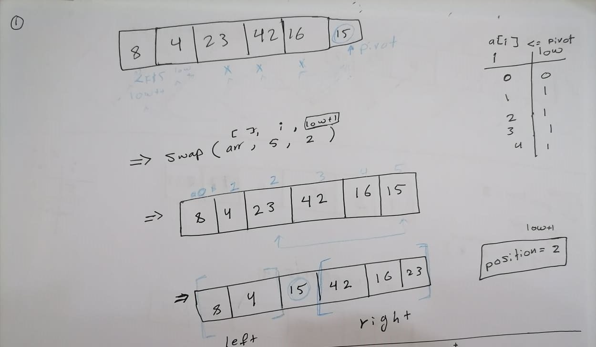
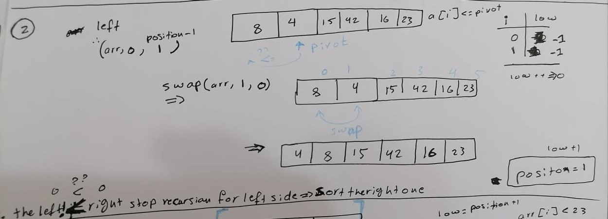
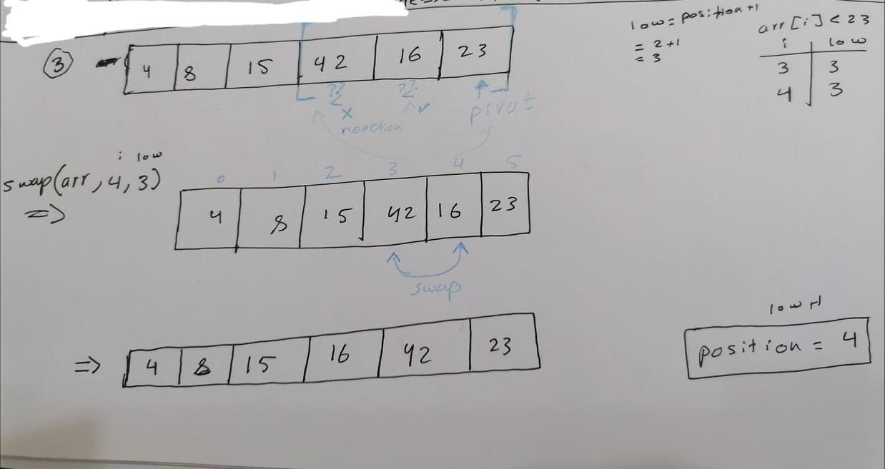
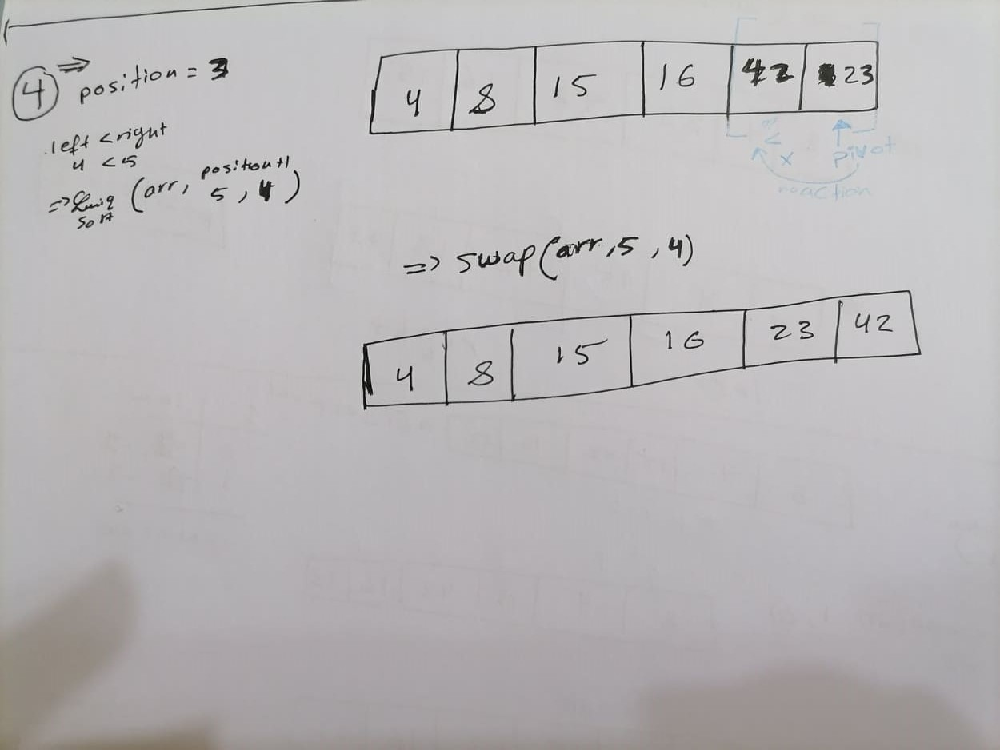

# Quicksort
 ***Quicksort***  : is a divide-and-conquer algorithm. It works by selecting a 'pivot' element from the array and partitioning the other elements into two sub-arrays, according to whether they are less than or greater than the pivot. For this reason, it is sometimes called partition-exchange sort.
 #
 ## Pseudocode
```
ALGORITHM QuickSort(arr, left, right)
    if left < right
        // Partition the array by setting the position of the pivot value 
        DEFINE position <-- Partition(arr, left, right)
        // Sort the left
        QuickSort(arr, left, position - 1)
        // Sort the right
        QuickSort(arr, position + 1, right)

ALGORITHM Partition(arr, left, right)
    // set a pivot value as a point of reference
    DEFINE pivot <-- arr[right]
    // create a variable to track the largest index of numbers lower than the defined pivot
    DEFINE low <-- left - 1
    for i <- left to right do
        if arr[i] <= pivot
            low++
            Swap(arr, i, low)

     // place the value of the pivot location in the middle.
     // all numbers smaller than the pivot are on the left, larger on the right. 
     Swap(arr, right, low + 1)
    // return the pivot index point
     return low + 1

ALGORITHM Swap(arr, i, low)
    DEFINE temp;
    temp <-- arr[i]
    arr[i] <-- arr[low]
    arr[low] <-- temp
```
#
## Trace

- Sample Arrays : [8,4,23,42,16,15]
#### Pass 1:
- What we do here that we take the last element in the array as a pivot .
-  Then we declare a variable `low` which weill count the elements smaller than the pivot,so we will loop over the main array comparing the elements with the pivot , increase `low` whenever their is an element smaller than it.
- Once we finished ,we will set our pivot on its right position of `low+1` .
- **We do over the previous steps in Pass 1 for subs array at the left an the right of pivot**


#### Pass 2:
- Here we take the array of the left side of the position of the passed pivot, and sort it.
- as we do in `Pass 1`  , set a new pivot which it was 4 .
- there are no elements smaller than the pivot so swap it to put it at the first index.

#### Pass 3:
- Now sort the right side of the pivot of `Pass 1` .
- your new pivot is 23.
- do as we did in `Pass 1`, so by the end you will swap the elements at the `3 ,4` indexes.

#### Pass 4:
- at the last stage your pivot is `23`.
- do what we do before ,by the end swap the elements at the `5 ,4` indexes.

#
## Efficiency :

- Time: O(n^2)
  - **worst case time complexity** 
  - Each partition step is invoked recursively from the previous one. Given that, we can take the complexity of each partition call and sum them up to get our total complexity of the Quicksort algorithm.

  - Therefore, the time complexity of the Quicksort algorithm in worst case is {[N + (N - 1) + (N - 2) + (N -3) + ..... + 2] = [{N(N + 1)}/{2} - 1] ={O}(N^2)}
  - As a result,{T(N) = N + (N-1) + (N-2) ... + 3 + 2 =  [{N(N + 1)}/{2} - 1] =`{O}(N^2)}}`
- **Average case time complexity** 
- For example : 
  - considering the case when partition puts O(n/9) elements in one set and O(9n/10) elements in other set. Following is recurrence for this case. 
  - T(n) = T(n/9) + T(9n/10) + \theta(n)
  - Solution of above recurrence is also `O(nLogn)`
- Space: O(1)
  - No additional space is being created. This array is being sorted in place…keeping the space at constant O(1).
