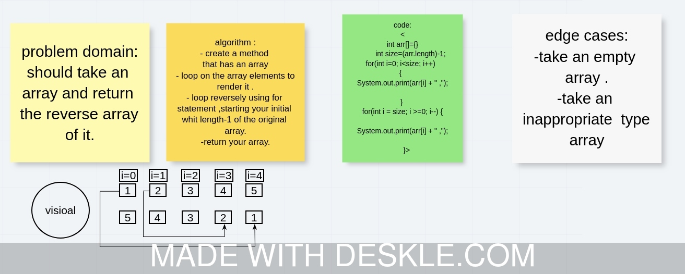

# Reverse an Array
- take an array and return the revers of it .

## Challenge
- no challenge regarding to the codding .
- technical issue was happened.
## Approach & Efficiency
just revers it :take your final index of original array and set it as the initialized for the revers array.

## Solution
