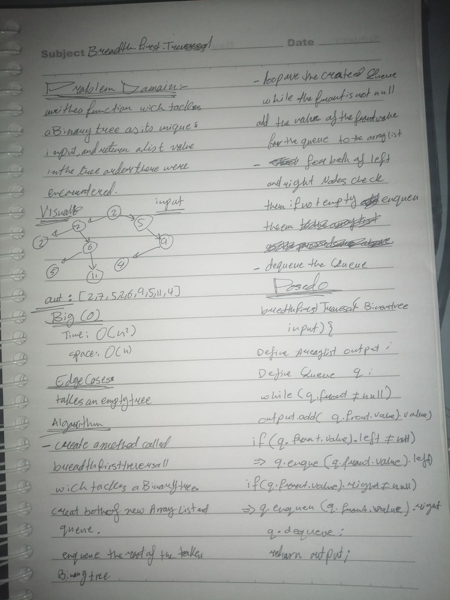

# Code Challenge: Class 16
# Find Maximum Value Binary Tree
## Challenge Summary

## Challenge
* Write an instance method `find-maximum-value`.
* Don't utilize any of the built-in methods.
*  INPUT: Binary Tree
*  OUTPUT: the maximum value stored in the tree.
  
## Approach and Efficiency
- **The approach taken for this challenge** was  to call the InOrder method for the binary tree and return the last index of that stored array which is the last right in the last level.
-  `InOrder` :since we extend the binary tree class ,i did use `InOrder` method to traverse the tree . 
- This method takes:
  - time :O(n) 

## Solution

#

# Code Challenge: Class 17
##  Breadth-first Traversal
## Challenge Summary

## Challenge
* Write an instance method `breadthFirstTraversal`.
* Don't utilize any of the built-in methods.
*  INPUT: Binary Tree
*  OUTPUT:  A list of the values in the tree in the order they were encountered.
  
## Approach and Efficiency
- **The approach taken for this challenge**
  - create an empty queue q and an array list 
  - then loop over while the front is not empty
  - add the front value to the array list 
  - enqueue the left then right children to q
  - dequeue a node from q.

- **This method takes:**
  - time :O(n^2) 

## Solution

