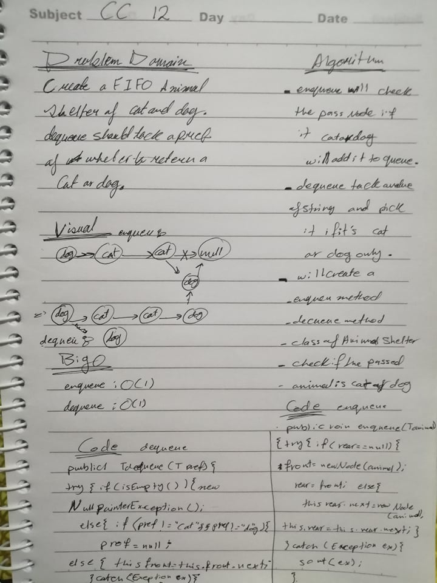

# Code Challenge: Class 12
## First-in, First-out Animal Shelter
## Challenge
- Create a class called AnimalShelter which holds only dogs and cats.
-  The shelter operates using a first-in, first-out approach. 
-  The shelter should have an enqueue(animal) method that will add either a cat or dog object to the shelter. 
-  The shelter should also have a dequeue(pref) method that takes a preference of either cat or dog and returns either a cat or dog based on that preference.

## Approach and Efficiency
- enqueue Big O: O(n)
- dequeue Big O:O(1)
## Solution
